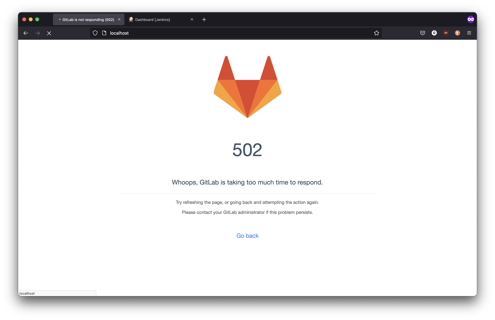
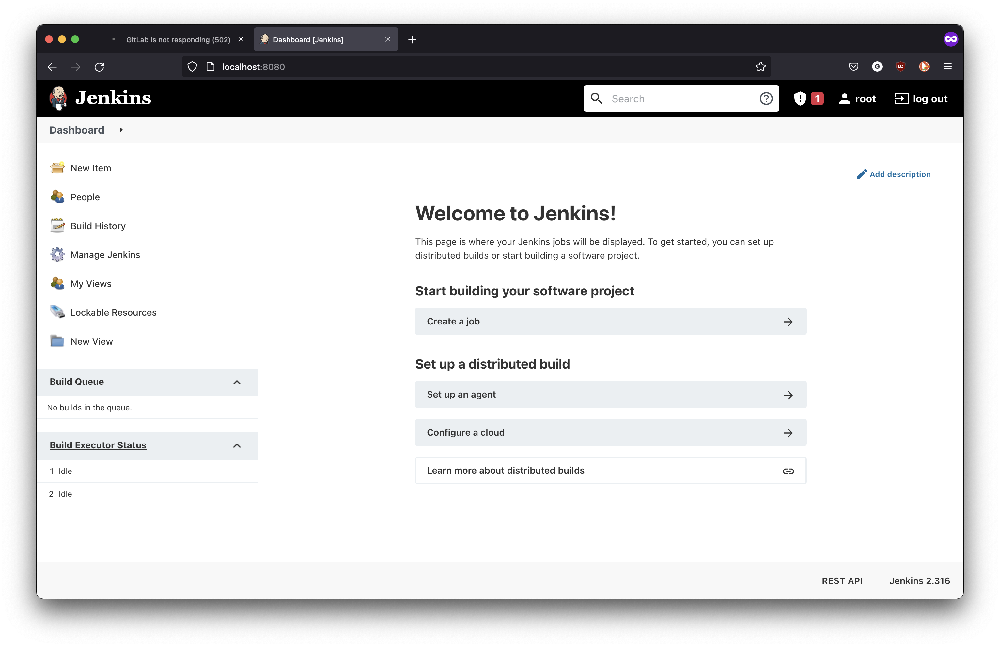

#  Gitlab + Jenkins on Docker

**WARNING: This 2 docker takes 5GB of memory (gitlab has a 4GB minimum requirements, jenkins has 1GB minimum requirements), make sure you can handle it before run docker compose**

## Development

- Clone repository
- Ensure to have Docker
- Run `docker compose up -d`

## Screenshots

**Sorry for the gitlab screenshot, but I can't get started for now**

